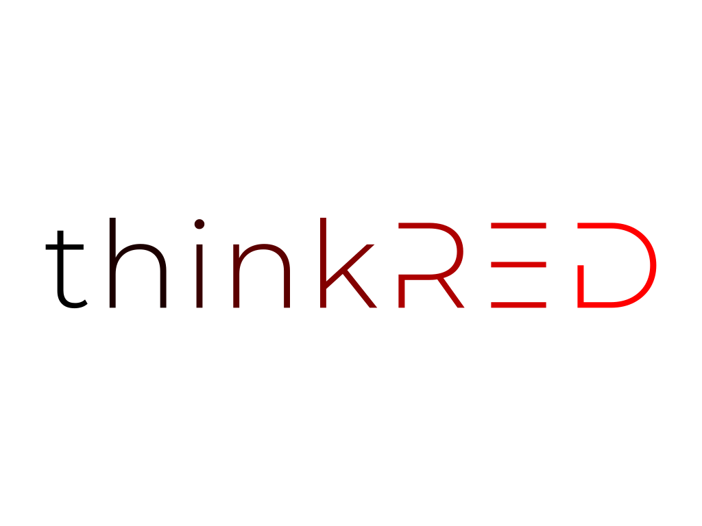

<div align="center">

# 🚀 ThinkRED Technologies


### *Engineering Excellence • Innovation-Led Technology Solutions*

[](https://www.thinkred.tech)
[](./CHANGELOG.md)
[](LICENSE)

**🔗 Quick Navigation:** [🚀 Quick Start](#-quick-start) • [📚 Documentation](#-documentation) • [💼 Careers](https://www.thinkred.tech/careers) • [📊 Live Status](#-monitoring--status)

</div>

<br />

## 📊 Project Status & Health

<div align="center">

| **Metric** | **Status** | **Action** |
|:-----------|:----------:|:-----------|
| **🚀 CI/CD Pipeline** |  | [View Workflow](https://github.com/sayakdeepghosh01/thinkred-website-react19-vite/actions/workflows/ci-cd-pipeline.yml) |
| **🔒 Security Checks** |  | [Security Report](./docs/security-architecture.md) |
| **🏥 Repository Health** |  | [Health Dashboard](./reports/health-report.md) |
| **⚡ Performance** |  | [Performance Report](./reports/status-dashboard.md) |
| **📦 Dependencies** |  | [Dependency Health](https://github.com/sayakdeepghosh01/thinkred-website-react19-vite/actions) |

</div>

<br />

## 🌟 About ThinkRED

**ThinkRED Technologies LLP** is a premier engineering-focused technology consultancy that transforms complex technological challenges into elegant solutions. Founded by engineers from **Mozilla**, **Fedora**, and **Red Hat**, we bring open-source innovation and enterprise-grade expertise to businesses worldwide.

<div align="center">

### 🎯 Our Mission

> **"Simplify Technology & Experience"**

</div>

<br />

## ✨ Key Highlights

<table>
<tr>
<td width="33%" align="center">

### 🔧 **Modern Stack**


[](./docs/)
[](https://github.com/thinkredtech/thinkredtech.github.io/actions)
[](https://github.com/thinkredtech/thinkredtech.github.io/actions)
[](https://github.com/thinkredtech/thinkredtech.github.io/actions)
[](https://github.com/thinkredtech/thinkredtech.github.io/actions)

[](./docs/)
[](https://github.com/thinkredtech/thinkredtech.github.io/actions)
[](https://github.com/thinkredtech/thinkredtech.github.io/actions)
[](https://github.com/thinkredtech/thinkredtech.github.io/actions)
[](https://github.com/thinkredtech/thinkredtech.github.io/actions)

[](./docs/)
[](https://github.com/thinkredtech/thinkredtech.github.io/actions)
[](https://github.com/thinkredtech/thinkredtech.github.io/actions)
[](https://github.com/thinkredtech/thinkredtech.github.io/actions)
[](https://github.com/thinkredtech/thinkredtech.github.io/actions)

[](./docs/)
[](https://github.com/thinkredtech/thinkredtech.github.io/actions)
[](https://github.com/thinkredtech/thinkredtech.github.io/actions)
[](https://github.com/thinkredtech/thinkredtech.github.io/actions)
[](https://github.com/thinkredtech/thinkredtech.github.io/actions)


### 📊 Repository Status[](https://github.com/thinkredtech/thinkredtech.github.io/actions)[](https://github.com/thinkredtech/thinkredtech.github.io/actions)[](https://github.com/thinkredtech/thinkredtech.github.io/actions)[](./docs/)

Latest technologies for blazing performance

</td>
<td width="33%" align="center">

### 🛡️ **Enterprise Security**


Multi-layer security with industry standards

</td>
<td width="33%" align="center">

### 🤖 **AI-Powered UX**


Intelligent features for enhanced user experience

</td>
</tr>
</table>

<br />

## 🚀 Quick Start

<div align="center">

### Get up and running in under 2 minutes! ⚡

</div>

```bash
# 1. 📥 Clone the repository
git clone https://github.com/sayakdeepghosh01/thinkred-website-react19-vite.git
cd thinkred-website-react19-vite

# 2. 📦 Install dependencies
npm install

# 3. 🚀 Start development server
npm run dev

# 4. 🌐 Open in browser
# Navigate to http://localhost:3000
```

<details>
<summary><strong>🔧 Development Commands</strong></summary>

| Command | Purpose | Usage |
|---------|---------|-------|
| `npm run dev` | 🔥 Hot reload development | Daily development |
| `npm run build` | 📦 Production build | Deployment prep |
| `npm run preview` | 👀 Preview build locally | Pre-deployment test |
| `npm run lint` | 🔍 Code quality check | Code review |
| `npm run type-check` | ✅ TypeScript validation | Type safety |
| `npm run format` | 💄 Code formatting | Code cleanup |
| `npm test` | 🧪 Run test suite | Quality assurance |

</details>

<br />

## 🏗️ Architecture & Tech Stack

<div align="center">

### Built with the latest and greatest technologies

</div>

<table>
<tr>
<td width="50%">

#### 🎯 **Core Technologies**

- **React 19** - Concurrent rendering & performance
- **TypeScript 5.5+** - Type safety & developer experience
- **Vite 6.3+** - Lightning-fast builds & HMR
- **TailwindCSS 3.4+** - Utility-first styling
- **React Router 7.0+** - Declarative routing

#### 🎨 **UI & Animation**

- **Framer Motion 11.3+** - Smooth animations
- **Three.js** - 3D graphics & avatar interactions
- **React Markdown 9.0+** - Content rendering
- **Headless UI 2.1+** - Accessible components
- **React Icons 5.3+** - Comprehensive icon library

</td>
<td width="50%">

#### ⚙️ **Development Tools**

- **ESLint 9.9+** - Code linting & consistency
- **Prettier 3.3+** - Code formatting
- **PostCSS 8.4+** - CSS transformations
- **Autoprefixer** - Browser compatibility
- **Husky** - Git hooks for quality

#### 🚀 **Deployment & CI/CD**

- **GitHub Actions** - Automated workflows
- **GitHub Pages** - Static hosting
- **Hostinger** - Alternative deployment
- **Automated Versioning** - Intelligent releases
- **Performance Monitoring** - Real-time metrics

</td>
</tr>
</table>

<br />

## 🌟 Feature Showcase

<details>
<summary><strong>💼 Job Application System</strong></summary>

<br />

- **📋 Browse Positions** - Dynamic job listings at [/careers](https://www.thinkred.tech/careers)
- **📄 Detailed Job Views** - Comprehensive job descriptions with requirements
- **📤 Online Applications** - Resume and cover letter upload with validation
- **🔒 Admin Management** - Secure admin panel for job posting management
- **🔗 SEO-Friendly URLs** - Human-readable job posting URLs
- **📱 Mobile Optimized** - Full functionality across all devices

</details>

<details>
<summary><strong>🎨 Design System & UI</strong></summary>

<br />

- **🎯 Unified Design Language** - Consistent typography, colors, and spacing
- **🧩 Component Library** - Reusable UI components architecture
- **🔍 Advanced Search & Filtering** - Professional interfaces with state persistence
- **♿ Accessibility Compliant** - WCAG 2.1 AA compliance throughout
- **📱 Responsive Design** - Mobile-first approach with breakpoint optimization

</details>

<details>
<summary><strong>🤖 AI Avatar Assistant</strong></summary>

<br />

- **💤 Smart Sleep/Wake** - Context-aware behavior based on user interaction
- **🧭 Intelligent Navigation** - Page-aware suggestions and smart filtering
- **🎭 Contextual Responses** - Relevant options based on current location
- **✨ Interactive Animations** - Engaging visual feedback and transitions
- **👆 User Control** - Manual control with intuitive click interactions

</details>

<details>
<summary><strong>⚡ Performance Optimization</strong></summary>

<br />

- **📦 Code Splitting** - Vendor chunks for optimal caching
- **🌳 Tree Shaking** - Elimination of unused code
- **🖼️ Asset Optimization** - Compressed images and efficient loading
- **🔄 Lazy Loading** - Components loaded on demand
- **🎯 Bundle Analysis** - Continuous size monitoring

</details>

<br />

## 📊 Monitoring & Status

<div align="center">

### Real-time insights into system health and performance

</div>

Our comprehensive monitoring system includes **6 automated workflows** ensuring continuous quality, security, and performance:

<table>
<tr>
<td width="50%">

#### 🔄 **Automated Workflows**

- **🚀 CI/CD Pipeline** - Build, test, deploy validation
- **🔍 Quality & Security** - Daily vulnerability scanning
- **🕵️ Data Protection** - Sensitive data monitoring
- **📊 Health Monitoring** - Repository metrics (6-hour intervals)
- **📈 Status Dashboard** - Real-time service monitoring
- **🏷️ Auto Versioning** - Intelligent release management

</td>
<td width="50%">

#### 📈 **Live Reports**

- **[📱 Status Dashboard](./reports/status-dashboard.md)** - Service status & metrics
- **[🏥 Health Report](./reports/health-report.md)** - Repository health assessment
- **[🔒 Security Report](./docs/security-architecture.md)** - Security implementation
- **[📊 Performance Data](./reports/)** - All monitoring reports
- **[🚀 GitHub Actions](https://github.com/sayakdeepghosh01/thinkred-website-react19-vite/actions)** - Workflow executions

</td>
</tr>
</table>

<div align="center">

### 📊 Current Metrics

| Metric | Value | Target | Status |
|:-------|:-----:|:------:|:------:|
| **Build Size** | ~850KB | <1MB | ✅ |
| **Lighthouse Score** | 95+ | 90+ | ✅ |
| **Security Grade** | A+ | A | ✅ |
| **Uptime** | 99.9% | 99.5% | ✅ |
| **Response Time** | <200ms | <500ms | ✅ |

</div>

<br />

## 🛡️ Security & Compliance

<div align="center">

### Enterprise-grade security built from the ground up

</div>

<table>
<tr>
<td width="50%">

#### 🔒 **Security Features**

- **🛡️ XSS Protection** - Comprehensive input sanitization
- **📋 Content Security Policy** - Strict CSP headers
- **✅ Input Validation** - Multi-layer validation with SQL injection detection
- **📁 File Upload Security** - MIME type and size validation
- **🔐 Authentication** - Environment-based admin security
- **🔧 Security Headers** - X-Frame-Options, X-Content-Type-Options

</td>
<td width="50%">

#### 🎯 **Compliance Standards**

- **📊 OWASP Top 10** - Security guideline compliance
- **🔒 Data Protection** - Secure user data handling
- **🚀 Secure Deployment** - Production security headers
- **🔄 Regular Updates** - Maintained security utilities
- **♿ WCAG 2.1 AA** - Accessibility compliance
- **📱 Cross-Browser** - Universal compatibility

</td>
</tr>
</table>

<br />

## 📚 Documentation

<div align="center">

### Comprehensive guides and specifications

</div>

<table>
<tr>
<td width="50%">

#### 📖 **Technical Documentation**

- **[🏗️ Website Architecture](./docs/website-overview.md)** - Technical overview & objectives
- **[🔒 Security Implementation](./docs/security-architecture.md)** - Security features & compliance
- **[🎨 Design System](./docs/design-system.md)** - UI/UX design principles
- **[🏷️ Brand Guidelines](./docs/brand-guidelines.md)** - Visual identity standards
- **[🏢 Company Info](./docs/company-info.md)** - Mission, services, team

</td>
<td width="50%">

#### 📄 **Page Specifications**

- **[🏠 Landing Page](./docs/page-specs/landing_page.md)** - Brand introduction
- **[👥 About Page](./docs/page-specs/about_page.md)** - Company story
- **[⚙️ Services Page](./docs/page-specs/services_page.md)** - Service offerings
- **[💼 Portfolio Page](./docs/page-specs/portfolio_page.md)** - Case studies
- **[📞 Contact Page](./docs/page-specs/contact_page.md)** - Client engagement
- **[📝 Blog Page](./docs/page-specs/blog_page.md)** - Thought leadership

</td>
</tr>
</table>

<br />

## 📁 Project Structure

<details>
<summary><strong>🗂️ Explore the organized codebase structure</strong></summary>

```text
thinkred-website-react19-vite/
├── 🎯 Core Application
│   ├── 📁 src/                   # Source code
│   │   ├── 📁 components/        # React components
│   │   │   ├── 📁 ui/           # Reusable UI components
│   │   │   ├── 📁 features/     # Feature-specific components
│   │   │   └── 📁 forms/        # Form components
│   │   ├── 📁 pages/            # Page components (routes)
│   │   ├── 📁 hooks/            # Custom React hooks
│   │   ├── 📁 utils/            # Utility functions
│   │   ├── 📁 data/             # Static data & constants
│   │   ├── 📁 styles/           # Global styles & themes
│   │   └── 📁 types/            # TypeScript definitions
│   └── 📁 public/               # Static assets
│       ├── 📁 assets/           # Images, icons, logos
│       └── 📄 manifest.json     # PWA manifest
│
├── 📚 Documentation
│   ├── 📁 docs/                 # Documentation source
│   │   ├── 📁 page-specs/       # Page specifications
│   │   └── 📁 dev-checklists/   # Development guides
│   └── 📁 reports/              # Automated reports
│
├── 🔧 Configuration
│   ├── 📄 package.json          # Dependencies & scripts
│   ├── 📄 tsconfig.json         # TypeScript config
│   ├── 📄 vite.config.ts        # Vite build config
│   ├── 📄 tailwind.config.js    # TailwindCSS config
│   └── 📄 eslint.config.js      # ESLint config
│
└── 🚀 Deployment
    ├── 📁 .github/workflows/    # CI/CD workflows
    ├── 📄 deploy-hostinger.sh   # Deployment script
    └── 📁 build/                # Production build output
```

</details>

<br />

## 🚀 Deployment

<div align="center">

### Multiple deployment options for maximum flexibility

</div>

<table>
<tr>
<td width="50%">

#### 🤖 **Automated Deployment** (Recommended)

1. **Push to main** triggers automatic deployment
2. **GitHub Actions** builds and optimizes assets
3. **GitHub Pages** serves at [thinkred.tech](https://www.thinkred.tech)
4. **Custom domain** with SSL automatically managed

</td>
<td width="50%">

#### 🛠️ **Manual Deployment**

```bash
# Build the project
npm run build

# Deploy to GitHub Pages
npm run deploy

# Or upload build/ to hosting provider
```

</td>
</tr>
</table>

<details>
<summary><strong>🌐 Domain Configuration</strong></summary>

<br />

- **Primary Domain**: `www.thinkred.tech`
- **Redirect**: `thinkred.tech` → `www.thinkred.tech`  
- **SSL Certificate**: Automatically managed by GitHub Pages
- **CDN**: Global edge locations for optimal performance

</details>

<br />

## 🧪 Testing & Quality Assurance

<div align="center">

### Comprehensive quality gates ensure reliable code

</div>

<table>
<tr>
<td width="50%">

#### 🔍 **Code Quality Tools**

- **TypeScript** - Static type checking
- **ESLint** - Code linting & consistency  
- **Prettier** - Automated code formatting
- **Husky** - Git hooks for quality gates
- **GitHub Actions** - Automated testing pipeline

</td>
<td width="50%">

#### 🧪 **Testing Commands**

```bash
npm run type-check    # TypeScript validation
npm run lint          # ESLint analysis
npm run lint:fix      # Auto-fix issues
npm run format        # Format with Prettier
npm run format:check  # Check formatting
npm test              # Run test suite
```

</td>
</tr>
</table>

<br />

## 🌐 Browser Compatibility

<div align="center">

### Universal compatibility across modern browsers

</div>

| Browser | Support | Theme Color | Notes |
|:--------|:-------:|:-----------:|:------|
| **Chrome** (latest) | ✅ Full | ✅ | Complete feature support |
| **Firefox** (latest) | ✅ Full | ⚠️ Partial | Theme color limited |
| **Safari** (latest) | ✅ Full | ✅ | iOS theme color supported |
| **Edge** (latest) | ✅ Full | ✅ | Complete compatibility |
| **Mobile Browsers** | ✅ Full | ✅ | Optimized for mobile |

<br />

## 🤝 Contributing

<div align="center">

### Join our community of contributors!

</div>

<table>
<tr>
<td width="50%">

#### 🐛 **Report Issues**

1. Check existing issues first
2. Use the bug report template
3. Include screenshots for visual bugs
4. Provide clear reproduction steps

#### ✨ **Request Features**

1. Open an issue with feature template
2. Describe the use case clearly
3. Discuss scope and complexity
4. Collaborate with maintainers

</td>
<td width="50%">

#### 🔧 **Development Workflow**

```bash
# 1. Fork & clone
git clone your-fork-url
cd thinkred-website-react19-vite

# 2. Create feature branch
git checkout -b feature/amazing-feature

# 3. Make changes & test
npm run lint && npm run type-check

# 4. Commit & push
git commit -m "feat: add amazing feature"
git push origin feature/amazing-feature

# 5. Create Pull Request
```

</td>
</tr>
</table>

<details>
<summary><strong>📝 Code Style Guidelines</strong></summary>

<br />

- **TypeScript**: Strict mode enabled, proper type definitions required
- **React**: Functional components with hooks, proper prop interfaces  
- **Styling**: TailwindCSS utilities, follow design system tokens
- **Naming**: Descriptive names, consistent casing conventions
- **Testing**: Include tests for new features and bug fixes
- **Documentation**: Update docs for significant changes

</details>

<br />

## 🔧 Troubleshooting

<details>
<summary><strong>🚨 Common Issues & Solutions</strong></summary>

<br />

#### Build Errors

```bash
# Clear cache and reinstall
rm -rf node_modules package-lock.json
npm install

# Type check issues
npm run type-check
```

#### Development Server Issues

```bash
# Check port availability
lsof -ti:3000
kill -9 <PID>

# Restart dev server
npm run dev
```

#### Deployment Issues

```bash
# Test build locally
npm run build
npm run preview

# Check GitHub Actions logs
# Visit: https://github.com/sayakdeepghosh01/thinkred-website-react19-vite/actions
```

</details>

<br />

## 📄 License & Support

<div align="center">

### Get help and stay connected

</div>

<table>
<tr>
<td width="50%">

#### 📄 **License**
This project is licensed under the **MIT License** - see the [LICENSE](LICENSE) file for details.

#### 💬 **Get Support**

- **📧 Email**: [hello@thinkred.tech](mailto:hello@thinkred.tech) *(24-48 hours)*
- **🐛 Issues**: [GitHub Issues](https://github.com/sayakdeepghosh01/thinkred-website-react19-vite/issues) *(2-5 business days)*
- **💼 Business**: [Contact Form](https://www.thinkred.tech/contact) *(1-2 business days)*

</td>
<td width="50%">

#### 🌐 **Connect With Us**
[](https://www.thinkred.tech)
[](https://github.com/thinkredtech)
[](https://linkedin.com/company/thinkred-technologies)

</td>
</tr>
</table>

---

<div align="center">

### 🎯 Latest Updates (v1.0.4)

**✨ Complete CI/CD pipeline stabilization with zero workflow failures**  
Enhanced automation reliability • Improved monitoring • Streamlined deployment

---



#### Made with ❤️ by the ThinkRED Technologies team

*Simplifying Technology & Experience, one project at a time.*

[](https://www.thinkred.tech)
[](./reports/status-dashboard.md)
[](https://github.com/sayakdeepghosh01/thinkred-website-react19-vite/actions)

</div>
