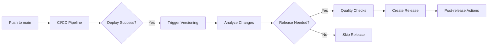

# 🏷️ Automated Versioning & Release Management

## Overview

This document describes the comprehensive automated versioning and release management system
implemented for the ThinkRED website repository. The system provides intelligent analysis of code
changes, commit patterns, and repository conditions to automatically determine appropriate version
bumps, create releases, and manage the complete software lifecycle with professional-grade
automation.

**Implementation Status**: ✅ **Complete and Operational** (June 20, 2025)

## 🎯 Key Features

### ✨ Intelligent Version Detection

- **Commit Message Analysis**: Advanced conventional commit pattern recognition
- **Change Type Classification**: Automatic detection of breaking changes, features, and fixes
- **File Change Analysis**: Smart analysis of modified files and their impact significance
- **Semantic Versioning**: Full SemVer compliance with prerelease support
- **Manual Override**: Emergency release capabilities with customizable parameters

### 🔄 Conditional Release Logic

- **Smart Release Triggers**: Based on changelog updates, security fixes, and change significance
- **Quality Gate Integration**: Pre-release validation with comprehensive testing pipeline
- **Security Priority**: Automatic releases for security updates regardless of other conditions
- **Emergency Releases**: Fast-track release process for critical hotfixes

### 🚀 Complete Release Automation

- **Package Version Management**: Automatic package.json version updates with validation
- **Git Tagging**: Annotated tag creation with comprehensive metadata and history
- **GitHub Release Creation**: Automated release generation with detailed notes and assets
- **Changelog Integration**: Smart CHANGELOG.md updates and synchronization
- **Deployment Coordination**: Seamless integration with CI/CD deployment workflows

## Workflow: `automated-versioning-release.yml`

### Triggers

- **Automatic**: Push to `main` branch (excluding documentation-only changes)
- **Manual**: Workflow dispatch with configurable options:
  - Version type: `auto`, `patch`, `minor`, `major`, `prerelease`
  - Force release: Option to bypass normal release conditions

### Workflow Jobs

#### 1. 📊 Analyze Changes

**Purpose**: Intelligent analysis of repository changes to determine versioning strategy

**Analysis Criteria**:

- **Commit Message Patterns**: Scans for conventional commit indicators
- **File Changes**: Examines which files were modified
- **CHANGELOG Updates**: Checks if CHANGELOG.md was updated
- **Breaking Changes**: Detects breaking change indicators
- **Feature Additions**: Identifies new features or enhancements
- **Bug Fixes**: Recognizes fix and patch commits
- **Security Updates**: Identifies security-related changes

**Conventional Commit Patterns**:

```
feat: New feature → Minor version bump
fix: Bug fix → Patch version bump
BREAKING: Breaking change → Major version bump
security: Security update → Patch version bump (auto-release)
perf: Performance improvement → Minor version bump
```

**Outputs**:

- `should-release`: Boolean indicating if release conditions are met
- `version-type`: Determined version bump type (major/minor/patch/prerelease)
- `current-version`: Current version from package.json
- `new-version`: Calculated new version
- `changelog-updated`: Whether CHANGELOG.md was modified
- Change detection flags for breaking changes, features, fixes

#### 2. 🧪 Pre-release Quality Checks

**Purpose**: Comprehensive quality validation before version updates

**Validation Steps**:

- **Lint Check**: Code style and syntax validation
- **Type Check**: TypeScript compilation verification
- **Test Suite**: Full test execution with coverage
- **Build Verification**: Production build success validation
- **Security Audit**: Vulnerability scanning

**Quality Gates**: All checks must pass for release to proceed

#### 3. 🚀 Create Release

**Purpose**: Automated version updates, tagging, and release creation

**Process**:

1. **Update package.json**: Bump version using semantic versioning
2. **Update CHANGELOG.md**: Auto-generate changelog entry if needed
3. **Commit Changes**: Version bump commit with standardized message
4. **Create Git Tag**: Annotated tag with comprehensive metadata
5. **Generate Release Notes**: Automated release notes with change summary
6. **Create GitHub Release**: Full release with generated notes and assets

**Release Metadata**:

- Version information and type
- Change analysis summary
- Commit list with links
- Technical details and metrics
- Links to documentation and live site

#### 4. 📢 Post-release Actions

**Purpose**: Post-release coordination and reporting

**Actions**:

- **Summary Generation**: Comprehensive release summary
- **Deployment Trigger**: Automatic deployment workflow trigger
- **Notification**: Release announcement and metrics

## Versioning Logic

### Semantic Versioning (SemVer)

The system follows [Semantic Versioning](https://semver.org/) principles:

```
MAJOR.MINOR.PATCH[-PRERELEASE]
  │     │     │        │
  │     │     │        └─ Pre-release identifier (beta.1, alpha.2, etc.)
  │     │     └─ Bug fixes, security patches, documentation
  │     └─ New features, performance improvements (backward compatible)
  └─ Breaking changes, major API changes
```

### Version Bump Decision Matrix

| Detected Changes                          | Version Type | Example           |
| ----------------------------------------- | ------------ | ----------------- |
| Breaking changes (BREAKING, !, major:)    | **Major**    | 1.0.0 → 2.0.0     |
| New features (feat, add, new)             | **Minor**    | 1.0.0 → 1.1.0     |
| Performance improvements (perf, optimize) | **Minor**    | 1.0.0 → 1.1.0     |
| Bug fixes (fix, bug, patch)               | **Patch**    | 1.0.0 → 1.0.1     |
| Security updates (security, vuln, cve)    | **Patch**    | 1.0.0 → 1.0.1     |
| Dependency updates (package.json)         | **Patch**    | 1.0.0 → 1.0.1     |
| Documentation only                        | **None**     | No version change |

### Prerelease Versioning

For beta/testing versions:

- **First prerelease**: `1.0.0` → `1.0.1-beta.1`
- **Subsequent prereleases**: `1.0.1-beta.1` → `1.0.1-beta.2`
- **Final release**: `1.0.1-beta.2` → `1.0.1`

## Release Conditions

### Automatic Release Triggers

1. **Version Change + Changelog Update**: Standard release condition
2. **Security Updates**: Automatic release regardless of changelog
3. **Breaking Changes**: Automatic release with proper documentation
4. **Major Versions**: Automatic release for significant changes

### Release Condition Matrix

| Condition               | Changelog Updated | Security Update | Breaking Change | Result         |
| ----------------------- | ----------------- | --------------- | --------------- | -------------- |
| Version change detected | ✅ Yes            | -               | -               | ✅ **Release** |
| Version change detected | ❌ No             | ✅ Yes          | -               | ✅ **Release** |
| Version change detected | ❌ No             | ❌ No           | ✅ Yes          | ✅ **Release** |
| Version change detected | ❌ No             | ❌ No           | ❌ No           | ⏸️ **Hold**    |
| No version change       | -                 | -               | -               | ⏸️ **Skip**    |

### Manual Release Override

Manual workflow dispatch allows:

- **Force Release**: Bypass normal conditions
- **Version Type Override**: Specify exact version bump type
- **Emergency Releases**: Quick releases for hotfixes

## Integration with CI/CD

### Workflow Coordination



### Quality Gates Integration

The versioning workflow integrates with existing quality assurance:

- **Pre-release Checks**: Full CI/CD validation before version updates
- **Deployment Verification**: Only trigger versioning after successful deployment
- **Security Validation**: Comprehensive security scanning before release
- **Performance Testing**: Performance validation included in quality gates

## Configuration

### Workflow Customization

**Environment Variables**:

- `NODE_VERSION`: Node.js version for consistency (default: '20')

**Configurable Parameters**:

- **Commit Analysis Patterns**: Customizable regex patterns for change detection
- **Quality Gate Thresholds**: Adjustable pass/fail criteria
- **Release Conditions**: Modifiable release trigger logic
- **Changelog Templates**: Customizable changelog entry formats

### Repository Settings

**Required Permissions**:

- `contents: write` - For version commits and tag creation
- `pull-requests: write` - For automated PR updates if needed
- `issues: write` - For issue creation during failures

**Recommended Branch Protection**:

- Require CI/CD pipeline success before merge
- Require quality and security checks
- Restrict direct pushes to main branch

## Best Practices

### Commit Message Guidelines

To ensure proper version detection, follow these commit message patterns:

```bash

# Features (Minor version bump)

feat: add new contact form validation
feature: implement job application filtering

# Bug fixes (Patch version bump)

fix: resolve memory leak in avatar component
bug: correct portfolio sorting logic

# Breaking changes (Major version bump)

feat!: restructure API endpoints
BREAKING: remove deprecated authentication method

# Security updates (Patch version bump + auto-release)

security: patch XSS vulnerability in forms
fix: resolve CVE-2024-12345 in dependencies

# Performance improvements (Minor version bump)

perf: optimize bundle size and loading times
optimize: improve image loading performance
```

### Changelog Maintenance

**Automatic Updates**: The system will auto-generate changelog entries, but manual updates are
preferred for detailed release notes.

**Manual Changelog Format**:

```markdown
## [1.2.0] - 2025-06-20

### ✨ **Minor Release** - New Features

- **Enhanced Security**: Comprehensive XSS protection implementation
- **Performance Optimization**: Reduced bundle size by 15%
- **User Experience**: Improved mobile responsiveness

**Release Date**: June 20, 2025 **Version**: 1.2.0
```

### Release Planning

**Development Workflow**:

1. Feature development in feature branches
2. PR review and merge to main
3. Automatic CI/CD pipeline execution
4. Automatic versioning and release (if conditions met)
5. Deployment and post-release verification

**Release Timing**:

- **Patch Releases**: Automatic (security fixes, bug fixes)
- **Minor Releases**: Automatic (new features, performance improvements)
- **Major Releases**: Automatic with enhanced validation (breaking changes)
- **Emergency Releases**: Manual trigger for critical hotfixes

## Monitoring and Reporting

### Release Metrics

The system tracks and reports:

- **Release Frequency**: Number of releases per month/quarter
- **Version Distribution**: Major vs minor vs patch releases
- **Quality Metrics**: Test coverage, build success rate
- **Security Metrics**: Vulnerability resolution time
- **Performance Metrics**: Build size, deployment time

### Notifications

**Automatic Notifications**:

- GitHub release notifications
- Workflow summary reports
- Quality gate status updates
- Security alert escalations

### Troubleshooting

**Common Issues**:

1. **No Release Created**:
   - Check if CHANGELOG.md was updated
   - Verify commit messages follow conventional format
   - Review release conditions in workflow output

2. **Version Detection Failed**:
   - Ensure package.json is properly formatted
   - Check for merge conflicts in version files
   - Verify Git tag history integrity

3. **Quality Checks Failed**:
   - Review test failures in CI/CD pipeline
   - Check lint and type errors
   - Verify build success before versioning

4. **Tag Creation Failed**:
   - Check repository permissions
   - Verify no existing tag conflicts
   - Review Git repository integrity

**Debug Mode**: Enable verbose logging by adding `debug: true` to workflow dispatch inputs.

## Future Enhancements

**Planned Features**:

- **Release Scheduling**: Planned release times and coordination
- **Dependency Update Integration**: Automatic version bumps for dependency updates
- **Multi-environment Deployment**: Staged release process across environments
- **Release Approval Workflow**: Optional manual approval for major releases
- **Advanced Analytics**: Detailed release impact analysis and metrics

## Security Considerations

**Secret Management**:

- Uses `GITHUB_TOKEN` for repository operations
- No custom secrets required for basic operation
- Secure workflow permission scoping

**Access Control**:

- Workflow restricted to main branch only
- Manual triggers require repository write access
- Release creation follows repository permission model

**Audit Trail**:

- Complete Git history of all version changes
- Workflow execution logs for accountability
- Release metadata for traceability

## Summary

The automated versioning and release management system provides:

✅ **Intelligent Version Detection**: Smart analysis of code changes ✅ **Quality Assurance**:
Comprehensive pre-release validation ✅ **Semantic Versioning**: Industry-standard version
management ✅ **Automated Release Creation**: Complete release lifecycle automation ✅ **CI/CD
Integration**: Seamless workflow coordination ✅ **Flexible Configuration**: Customizable rules and
conditions ✅ **Comprehensive Reporting**: Detailed metrics and summaries

This system ensures consistent, reliable, and professional software release management while
maintaining high quality standards and reducing manual overhead.
