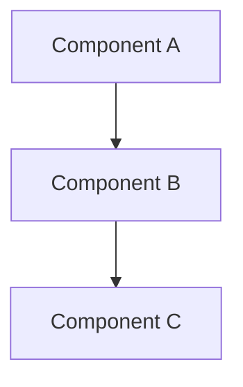

# [ARCHITECTURE COMPONENT NAME]

## Overview

Brief description of the architectural component, its purpose, and how it fits into the overall system.

## Architecture Diagram



## Key Components

### [Component Name 1]
- **Purpose**: What this component does
- **Technology**: Technology stack used
- **Dependencies**: Other components it depends on
- **Interfaces**: How other components interact with it

### [Component Name 2]
- **Purpose**: What this component does
- **Technology**: Technology stack used
- **Dependencies**: Other components it depends on
- **Interfaces**: How other components interact with it

## Data Flow

1. **Input**: How data enters the system
2. **Processing**: How data is transformed
3. **Output**: How results are delivered
4. **Storage**: How data is persisted

## Configuration

### Environment Variables
```bash
# Required environment variables
COMPONENT_CONFIG_VAR=value
ANOTHER_CONFIG_VAR=value
```

### Configuration Files
- `config/component.json` - Main configuration
- `.env.example` - Environment template

## Dependencies

### External Dependencies
- **[Dependency Name]**: Version, purpose, documentation link
- **[Another Dependency]**: Version, purpose, documentation link

### Internal Dependencies
- **[Internal Component]**: Purpose, interface
- **[Another Component]**: Purpose, interface

## API/Interfaces

### Public APIs
- `GET /api/endpoint` - Description
- `POST /api/endpoint` - Description

### Internal Interfaces
- `function_name(params)` - Description
- `another_function(params)` - Description

## Performance Considerations

- **Scalability**: How the component scales
- **Performance**: Expected performance characteristics
- **Bottlenecks**: Known limitations
- **Monitoring**: Key metrics to monitor

## Security

- **Authentication**: How authentication is handled
- **Authorization**: Permission model
- **Data Protection**: How sensitive data is protected
- **Security Considerations**: Important security notes

## Deployment

### Prerequisites
- Required infrastructure
- Dependencies that must be deployed first

### Deployment Steps
1. Step one
2. Step two
3. Step three

### Configuration
- Environment-specific configurations
- Deployment parameters

## Monitoring & Debugging

### Health Checks
- `/health` endpoint (if applicable)
- Key health indicators

### Logging
- Log levels and categories
- Important log entries to watch

### Metrics
- Key performance metrics
- Business metrics (if applicable)

## Troubleshooting

### Common Issues
| Issue | Symptoms | Solution |
|-------|----------|----------|
| [Issue 1] | [Symptoms] | [Solution] |
| [Issue 2] | [Symptoms] | [Solution] |

### Debug Commands
```bash
# Command to check status
component-status

# Command to view logs
component-logs
```

## Development

### Local Setup
1. Prerequisites for local development
2. Setup commands
3. Configuration for development

### Testing
- Unit test strategy
- Integration test approach
- Performance testing

### Contributing
- Code style guidelines
- Review process
- Deployment process

## Related Documentation

- [Related Architecture Doc](link)
- [API Documentation](link)
- [Deployment Guide](link)
- [Troubleshooting Guide](link)

## Changelog

### Version X.Y.Z (YYYY-MM-DD)
- **Added**: New features
- **Changed**: Modified functionality
- **Fixed**: Bug fixes
- **Removed**: Deprecated features

---

**Author**: [Author Name]  
**Last Updated**: [Date]  
**Review Date**: [Next Review Date]
